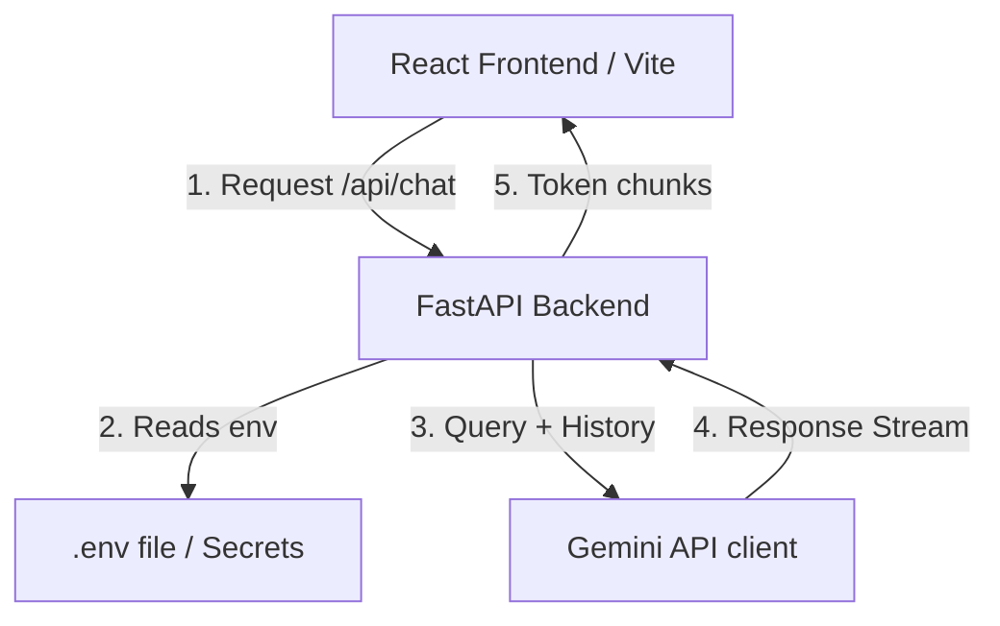

---
#Check out the configuration reference at https://huggingface.co/docs/hub/spaces-config-reference

# Neural Nexus - Premium AI-Powered Study Assistant

Neural Nexus is a modern, high-performance study companion application featuring a React-based frontend and a FastAPI Python backend powered by the Gemini 2.5 Flash model.

---

## ⚙️ How it Works (System Architecture & Data Flow)

Neural Nexus combines a fast asynchronous Python API with a highly responsive React client. The application flows as follows:



### 1. Frontend-Backend Interaction
- During **development**, the Vite dev server runs on `http://localhost:5173`. Any calls to `/api/...` are automatically proxied to the backend FastAPI port `http://127.0.0.1:8000` via the proxy rule configured in `vite.config.js`.
- In **production**, the React code is compiled into a `dist/` directory. FastAPI mounts this directory and serves `index.html` and static assets directly, allowing you to run the entire app on a single unified server port.

### 2. Chat and Persona Management
- Users select an **Assistant Personality** (Friendly Guide, Academic Professor, or Socratic Tutor) which maps to specific system instructions on the backend.
- Conversations are managed client-side in the `StudyContext` React provider, maintaining session history and syncing to browser `localStorage`.
- When a user submits a query, the backend converts the chat history format into the Google GenAI SDK's `types.Content` payload and streams the token chunks back to the client in real-time.

### 3. Document Indexing (RAG Context)
- Users can drag-and-drop notes and source code files (`.txt`, `.md`, `.py`, `.json`, `.csv`) in the Documents panel.
- The text is extracted server-side, and clicking **"Chat with Doc"** appends the document context to the user's chat prompt automatically, prompting the model to answer based specifically on the referenced files.

---

## 📦 Dependencies

The project relies on two independent dependency lists for the backend and frontend:

### 1. Python Backend Dependencies (`requirements.txt`)
* **`google-genai`**: Official Google GenAI SDK to interact with Gemini models.
* **`fastapi`**: Modern, fast ASGI web framework for building APIs.
* **`uvicorn`**: High-performance ASGI server implementation to run FastAPI.
* **`python-multipart`**: To parse incoming multipart/form-data for document uploads.
* **`jinja2`**: Template engine required for static asset loading.
* **`python-dotenv`**: Loads environment variables from the `.env` file into `os.environ`.

### 2. Node Frontend Dependencies (`package.json`)
* **`react` & `react-dom`**: Frontend framework.
* **`react-router-dom`**: Router for multi-page routing (Chat, Quizzes, Documents, Study Plans).
* **`lucide-react`**: Vector icons pack used throughout the layout.
* **`react-dropzone`**: Drag-and-drop file uploader component.
* **`react-markdown` & `remark-gfm`**: Formats markdown and tables returned from the AI model.
* **`tailwindcss` & `autoprefixer`**: Utility-first CSS framework for styles.
* **`vite`**: Faster bundler and server setup for React.

---

## 🚀 How to Run

### 1. Configuration Setup
1. In the `my-study-assistant` folder, duplicate the `env.example` file and name it `.env`:
   ```bash
   cp env.example .env
   ```
2. Open the `.env` file and insert your Gemini API Key:
   ```env
   GEMINI_API_KEY=YOUR_GEMINI_API_KEY_HERE
   ```

### 2. Run Mode: Development (Separate Servers)
Runs both servers independently with live hot-reloading for code edits.

#### Start the Backend:
```powershell
# Navigate to project
cd my-study-assistant

# Install Python requirements
.\env\Scripts\pip.exe install -r requirements.txt

# Launch FastAPI server
.\env\Scripts\python.exe -m uvicorn app:app --reload
```
*Backend runs on `http://127.0.0.1:8000`.*

#### Start the Frontend:
```bash
# In a new terminal
cd my-study-assistant

# Install node dependencies
npm install

# Start Vite dev server
npm run dev
```
*Frontend runs on `http://localhost:5173`.*

---

### 3. Run Mode: Production (Single Server)
Compiles React frontend code and serves it directly from the FastAPI server.

1. Build the frontend static bundle:
   ```bash
   npm run build
   ```
2. Start the FastAPI server:
   ```powershell
   .\env\Scripts\python.exe -m uvicorn app:app
   ```
3. Navigate to **`http://127.0.0.1:8000`** in your browser to view the application.
